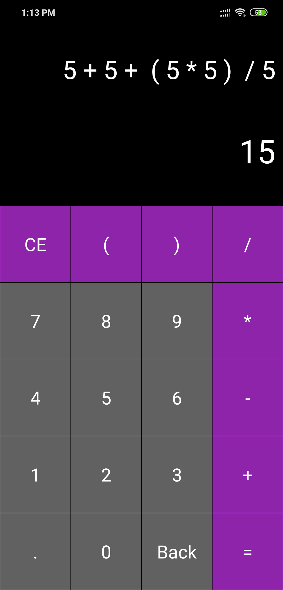

# Kotlin Calculator

Kotlin Calculator is a simple yet powerful calculator application designed for the Android platform. Built using Kotlin, this app performs various complex calculations with ease and offers an intuitive user interface. It's a great tool for both learning and practical use in your projects.

## Features

- **Basic Arithmetic Operations**: Addition, subtraction, multiplication, and division.
- **Advanced Calculations**: Supports functions like square root, power, and trigonometric operations.
- **User-Friendly Interface**: Clean design with easy-to-read display and responsive buttons.
- **History Functionality**: Keeps track of recent calculations for quick reference.
- **Customizable Themes**: Allows users to switch between different visual themes.

## Screenshots

## Installation

To get started with Kotlin Calculator, clone the repository and import it into your Android Studio environment. Follow these steps:

 **Clone the Repository**
 
   git clone https://github.com/your-username/kotlin-calculator.git

## License
This project is licensed under the MIT License. See the LICENSE file for details.
